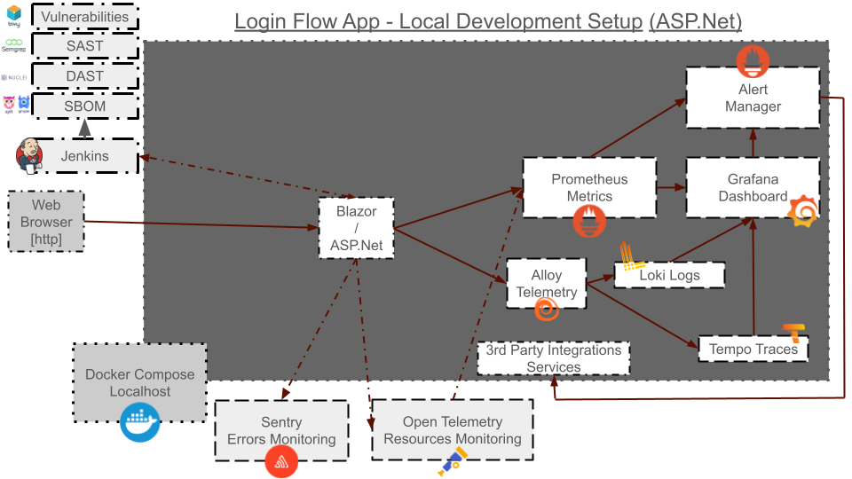
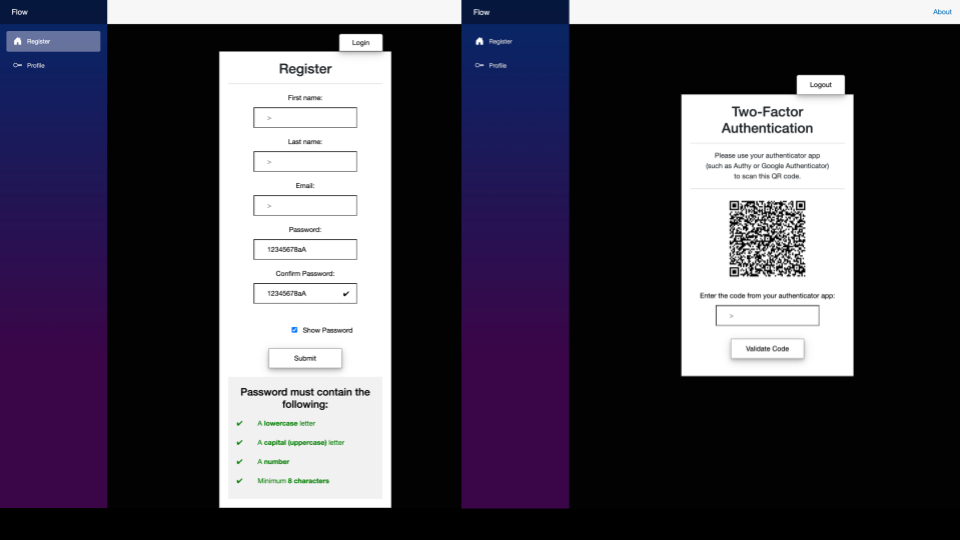
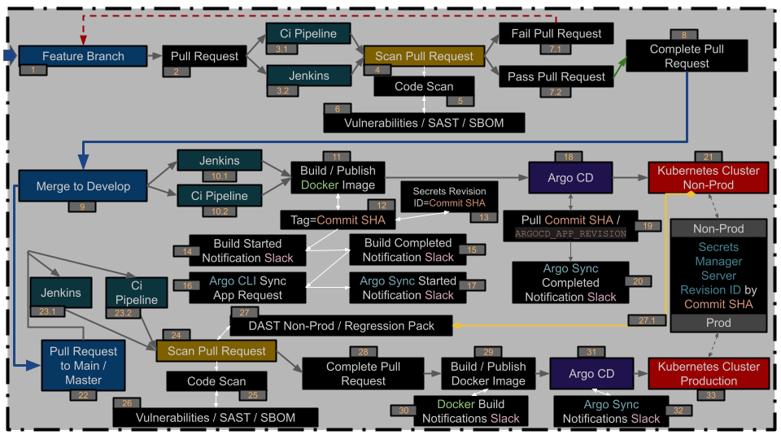

# Login MFA Flow Application

# Diagrams

> Local Development Diagram



---

> Application Security Diagram



---

> SOC 2 TYPE 2 / OWASP 10 / ISO 27001 Security Compliance Diagram


---

> CI/CD/GitOps Strategy Diagram



---
---

# Back-End Security

---

## SOC 2 TYPE 2 / OWASP 10 / ISO 27001 Compliance

---

### Security

> Protection of system resources and data against unauthorized access and disclosure.

#### Implementation: 

##### Secured Browsing

> Users Passwords Auth Encryption/Hashing: [BCrypt.Net package](https://www.nuget.org/packages/BCrypt.Net-Next)

> Users 2FA + QR Code Generation: [Otp.NET package](https://www.nuget.org/packages/Otp.NET/1.2.2)

> Apps CSRF Tokens Generation: [Blazor Antiforgery](https://learn.microsoft.com/en-us/aspnet/core/blazor/security/)

---

### Availability

> Accessibility of the system, products, or services as stipulated by service level agreements (SLAs).

#### Implementation: 

##### Secured Sandbox

> Sandboxed Environment: [docker](backend.Dockerfile)

> Sandboxed Environment Orchestration: [compose.yaml](compose.yaml)

---

### Processing Integrity

> Assurance that data processing is complete, valid, accurate, and timely.

#### Implementation: 

##### Uploaded Content

> Uploaded Content Isolation: [docker volumes](backend.Dockerfile) / [compose.yaml](compose.yaml)

> Uploaded Content Anti-Malware: [clamavnet](https://www.clamav.net/)

---

### Confidentiality

> Protection of sensitive information from unauthorized exposure.

#### Implementation: 

##### Data Traffic

> Database Data Anonymization: [System.Security.Cryptography package](https://www.nuget.org/packages/system.security.cryptography.pkcs/)

---

### Privacy

> Safeguarding personal information against unauthorized use or collection.

#### Implementation: 

##### Auditing & Tracing

> Tracing: [opentelemetry-dotnet package](https://opentelemetry.io/docs/languages/dotnet/)

---
---

# Code Structure

## CI/CD

> GitHub: [.github/workflows/github-actions.yml](.github/workflows/github-actions.yml)

> GitLab: [.gitlab-ci.yml](.gitlab-ci.yml)

> Jenkins: [Jenkinsfile](Jenkinsfile)

---

## GitOps

> Argo-CD Application Spec: [argo-cd-application-spec.yaml](.argo-cd/argo-cd-application-spec.yaml)

---

## DevSecOps

> Jenkins Container: [compose.yaml](compose.yaml) / [jenkins.Dockerfile](jenkins.Dockerfile)

> Jenkins Pipeline with Vulnerability Scanner, SBOM and SAST: [JenkinsfileScan](JenkinsfileScan)

> Docker Local Vulnerability Scanner, SBOM and SAST Container: [compose.yaml](compose.yaml) / [vulnerabilities.Dockerfile](vulnerabilities.Dockerfile)

> DAST Scanner Container and Config: [compose.yaml](compose.yaml)

- Vulnerability Scanner: [Trivy](https://github.com/aquasecurity/trivy)

- SBOM: [Syft](https://github.com/anchore/syft) / [Grype](https://github.com/anchore/grype)

- SAST: [Semgrep](https://github.com/semgrep/semgrep) / [Snyk](https://github.com/snyk/cli)

- DAST & Pen-Testing: [Nuclei](https://github.com/projectdiscovery/nuclei)

---

## SRE Monitoring

### Metrics

> Prometheus Config: [.prometheus/config/prometheus.yml](.prometheus/config/prometheus.yml)

> Prometheus Rules: [.prometheus/rules/prometheus.rules](.prometheus/rules/prometheus.rules)

> Prometheus Container: [compose.yaml](compose.yaml)

### Logging

> Loki Config (via Alloy): [.loki/config/loki-config.yaml](.loki/config/loki-config.yaml)

> Loki Container: [compose.yaml](compose.yaml)

### Tracing

> Tempo Config (via Alloy): [.tempo/config/tempo.yaml](.tempo/config/tempo.yaml)

> Tempo Container: [compose.yaml](compose.yaml)

### Resources and Networking

> OpenTelemetry Config: [opentelemetry-dotnet package](https://opentelemetry.io/docs/languages/dotnet/)

### Visualization

> Grafana Prometheus Datasource: [.grafana/datasources/prometheus-datasource.yaml](.grafana/datasources/prometheus-datasource.yaml)

> Grafana Loki Datasource: [.grafana/datasources/loki-datasource.yaml](.grafana/datasources/loki-datasource.yaml)

> Grafana Tempo Datasource: [.grafana/datasources/tempo-datasource.yaml](.grafana/datasources/tempo-datasource.yaml)

> Grafana Alert: [.grafana/alerting/sample-aspnet-alert-resource.yaml](.grafana/alerting/sample-aspnet-alert-resource.yaml)

> Grafana Container: [compose.yaml](compose.yaml)

### Alerting

> Alertmanager Config: [.alertmanager/config/alertmanager.yml](.alertmanager/config/alertmanager.yml)

> Alertmanager Container: [compose.yaml](compose.yaml)

### Unified Telemetry Collector

> Alloy Config (for Loki / Tempo): [.alloy/config/config.alloy](.alloy/config/config.alloy)

> Alloy Container: [compose.yaml](compose.yaml)

---

## Backend Execution

1. In terminal (Without Prometheus and Grafana stack):
```bash
dotnet watch
```

2. Orchestration with Docker Compose (With Prometheus and Grafana stack):
```bash
docker compose up --build --no-deps --force-recreate --remove-orphans
```

---

## IaC Config Tooling

> Ansible Inventory: [.ansible/inventory/docker_hosts.ini](.ansible/inventory/docker_hosts.ini)

> Ansible Vulnerabilities Playbook: [.ansible/playbooks/vulnerabilities_local_scan.yaml](.ansible/playbooks/vulnerabilities_local_scan.yaml)

> Ansible Host Dockerfile: [vulnerabilities.Dockerfile](vulnerabilities.Dockerfile)

> Ansible Python3.12+ Requirements: [ansible/ansible-requirements.txt](ansible/ansible-requirements.txt)

```bash
python3 -m venv ./.ansible/.venv-ansible

source ./.ansible/.venv-ansible/bin/activate

python3 -m pip install -r ./.ansible/ansible-requirements.txt

ansible-inventory -i ./.ansible/inventory/docker_hosts.ini --list

ansible-playbook -i ./.ansible/inventory/docker_hosts.ini ./.ansible/playbooks/vulnerabilities_local_scan.yaml

deactivate

rm -rf ./.ansible/.venv-ansible
```
